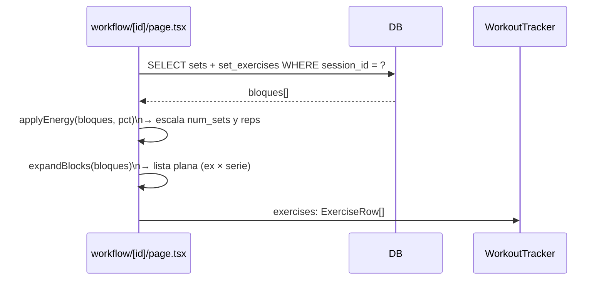
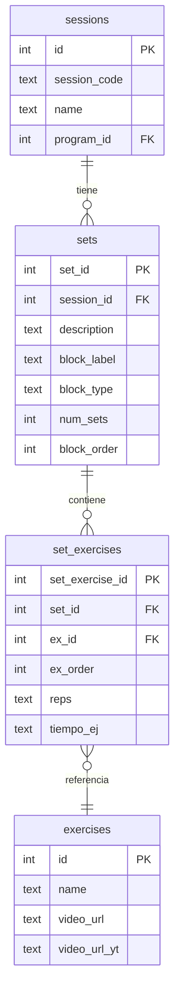

# Diseño Técnico: program-block-model

## Overview

El modelo actual de `session_exercises` almacena una fila por cada par *(ejercicio × número de serie)*. Esto genera redundancia: si un bloque tiene 3 ejercicios y 4 series, se necesitan 12 filas para representarlo. El nuevo modelo introduce la entidad **bloque** (`sets`) como unidad de repetición: un bloque declara cuántas veces se repite (`num_sets`) y agrupa sus ejercicios una sola vez en `set_exercises`. La expansión a la lista plana que necesita el `WorkoutTracker` se realiza en memoria en el servidor, sin cambios en el componente cliente.

El alcance de esta feature cubre:

1. Nuevas tablas `sets` y `set_exercises` en SQLite.
2. Script de migración idempotente desde `session_exercises`.
3. Actualización del `ProgramWizard` (UI de bloques en lugar de filas por serie).
4. Actualización de los endpoints `POST/PUT/GET /api/admin/programs`.
5. Actualización de `workflow/[id]/page.tsx` para leer del nuevo modelo y expandir en memoria.
6. Actualización del exportador/importador Excel (hojas `Sets` y `Set_Exercises`).
7. Restauración de `video_url_yt` para ejercicios con vídeo local sin URL de YouTube.

---

## Architecture

```mermaid
graph TD
    subgraph "Base de datos SQLite"
        SE[session_exercises\n(deprecated, read-only)]
        S[sets]
        SX[set_exercises]
        SES[sessions]
        EX[exercises]
        SES -->|1:N| S
        S -->|1:N| SX
        SX -->|N:1| EX
    end

    subgraph "API Routes (Next.js App Router)"
        POST[POST /api/admin/programs]
        PUT[PUT /api/admin/programs/:id]
        GET_ID[GET /api/admin/programs/:id]
    end

    subgraph "Componentes React"
        WZ[ProgramWizard]
        WT[WorkoutTracker\n(sin cambios internos)]
    end

    subgraph "Servidor (RSC)"
        WF[workflow/:id/page.tsx\nexpansión en memoria]
    end

    subgraph "Lib"
        EXP[programExporter.ts]
        IMP[programImporter.ts]
        MIG[migrate.ts]
        MIG_SCRIPT[scripts/migrate-to-blocks.ts]
    end

    WZ -->|JSON bloques| POST
    WZ -->|JSON bloques| PUT
    GET_ID -->|bloques + ejercicios| WZ
    WF -->|lista expandida| WT
    WF -->|lee sets + set_exercises| S
    POST -->|inserta| S
    PUT -->|borra + reinserta| S
    EXP -->|lee sets + set_exercises| S
    IMP -->|inserta sets + set_exercises| S
    MIG_SCRIPT -->|lee session_exercises, escribe sets| S
```

### Flujo de expansión en memoria



---

## Components and Interfaces

### Tipos TypeScript nuevos / modificados

```typescript
// src/types/index.ts (adiciones)

export interface WizardBlock {
  tempId: string;
  block_label: string;       // 1 carácter, p.ej. "A"
  block_type: BlockType;
  num_sets: number;          // >= 1
  description: string;       // opcional, visible en wizard
  block_order: number;
  exercises: WizardBlockExercise[];
}

export interface WizardBlockExercise {
  tempId: string;
  ex_id: number;
  ex_name: string;
  ex_order: number;
  reps: string;
  tiempo_ej: string;
}

export type BlockType =
  | 'normal' | 'circuit' | 'superset' | 'super_series'
  | 'tabata' | 'interval_repetitions' | 'interval_repetitions_with_pause'
  | 'to_the_one' | 'spartan_race' | 'paleo_run';

// WizardSession se modifica: exercises[] → blocks[]
export interface WizardSession {
  tempId: string;
  numero_sesion: number;
  nombre_sesion: string;
  blocks: WizardBlock[];
}
```

### ProgramWizard (modificado)

El wizard mantiene sus 4 pasos. El paso 2 (Ejercicios) pasa a gestionar **bloques**:

- Cada sesión tiene una lista de `WizardBlock`.
- Cada bloque tiene: `block_label`, `block_type`, `num_sets`, `description`, y una lista de `WizardBlockExercise`.
- Controles de reordenación (↑↓) para bloques y para ejercicios dentro de cada bloque.
- Botones "Añadir bloque" y "Eliminar bloque".
- Botones "Añadir ejercicio" y "Eliminar ejercicio" dentro de cada bloque.
- El resumen (paso 3) muestra: nº de bloques por sesión, `block_label`, `num_sets` y ejercicios de cada bloque.

### API endpoints (modificados)

**`POST /api/admin/programs`**
- Body: `{ name, description, image_url, sessions: WizardSession[] }`
- Inserta en `sets` y `set_exercises`. No escribe en `session_exercises`.

**`PUT /api/admin/programs/:id`**
- Genera backup Excel antes de modificar.
- Borra `sets` (cascade elimina `set_exercises`) de las sesiones del programa.
- Recrea sesiones, `sets` y `set_exercises` desde el body.

**`GET /api/admin/programs/:id`**
- Devuelve `{ ...program, sessions: [{ ...session, blocks: [{ ...set, exercises: [...] }] }] }`

### workflow/[id]/page.tsx (modificado)

Función `expandBlocks`:

```typescript
function expandBlocks(blocks: BlockRow[]): ExerciseRow[] {
  const result: ExerciseRow[] = [];
  for (const block of blocks.sort((a, b) => a.block_order - b.block_order)) {
    for (let s = 1; s <= block.num_sets; s++) {
      for (const ex of block.exercises.sort((a, b) => a.ex_order - b.ex_order)) {
        result.push({
          block: block.block_label,
          block_type: block.block_type,
          set_number: s,
          ex_id: ex.ex_id,
          ex_order: ex.ex_order,
          tiempo_ej: ex.tiempo_ej,
          reps: ex.reps,
          name: ex.name,
          video_url: ex.video_url,
          video_url_yt: ex.video_url_yt,
        });
      }
    }
  }
  return result;
}
```

`applyEnergy` se adapta para escalar `num_sets` antes de la expansión (en lugar de filtrar filas ya expandidas).

### programExporter.ts (modificado)

- Hoja `Sets`: `set_id`, `id_sesion`, `description`, `block_label`, `block_type`, `num_sets`, `block_order`.
- Hoja `Set_Exercises`: `set_exercise_id`, `set_id`, `id_ejercicio`, `ex_order`, `repeticiones`, `tiempo`.
- Mantiene hojas `Programa`, `Sesiones`, `Ejercicios` sin cambios.
- Elimina la hoja `Session_Exercises`.

### programImporter.ts (modificado)

- Requiere hojas `Sets` y `Set_Exercises` (no `Session_Exercises`).
- Valida columnas obligatorias antes de procesar.
- Inserta en `sets` y `set_exercises` mapeando IDs de Excel a IDs de BD.

### Script de migración (`scripts/migrate-to-blocks.ts`)

Script Node/TypeScript independiente (no parte del servidor Next.js):

1. Lee `session_exercises` agrupando por `(session_id, block, block_type)`.
2. Para cada grupo, crea un registro en `sets` con `num_sets = MAX(set_number)` y `block_order` según el primer `ex_order` mínimo del grupo.
3. Inserta en `set_exercises` los ejercicios únicos del grupo (usando `set_number = 1` como referencia).
4. Idempotente: omite sesiones que ya tienen datos en `sets`.
5. Restaura `video_url_yt` leyendo los Excel de `recursos/Programas Mammoth Hunters/`.

---

## Data Models

### Tabla `sets` (nueva)

```sql
CREATE TABLE IF NOT EXISTS sets (
  set_id      INTEGER PRIMARY KEY AUTOINCREMENT,
  session_id  INTEGER NOT NULL REFERENCES sessions(id) ON DELETE CASCADE,
  description TEXT,
  block_label TEXT,
  block_type  TEXT,
  num_sets    INTEGER NOT NULL DEFAULT 1,
  block_order INTEGER NOT NULL
);

CREATE INDEX IF NOT EXISTS idx_sets_session_order
  ON sets (session_id, block_order);
```

### Tabla `set_exercises` (nueva)

```sql
CREATE TABLE IF NOT EXISTS set_exercises (
  set_exercise_id INTEGER PRIMARY KEY AUTOINCREMENT,
  set_id          INTEGER NOT NULL REFERENCES sets(set_id) ON DELETE CASCADE,
  ex_id           INTEGER NOT NULL REFERENCES exercises(id),
  ex_order        INTEGER NOT NULL,
  reps            TEXT,
  tiempo_ej       TEXT
);
```

### Tabla `session_exercises` (deprecada, sin cambios)

Permanece en la BD sin modificaciones. Ningún código nuevo escribe en ella. Se puede eliminar en una fase posterior con un `DROP TABLE session_exercises` sin afectar funcionalidad activa.

### Diagrama entidad-relación



### Formato JSON de la API (GET /api/admin/programs/:id)

```json
{
  "id": 1,
  "name": "Unbreakable",
  "sessions": [
    {
      "id": 10,
      "numero_sesion": 1,
      "nombre_sesion": "Sesión 1",
      "blocks": [
        {
          "set_id": 100,
          "block_label": "A",
          "block_type": "normal",
          "num_sets": 4,
          "description": "Calentamiento",
          "block_order": 1,
          "exercises": [
            { "set_exercise_id": 200, "ex_id": 5216, "ex_name": "Sentadilla", "ex_order": 1, "reps": "10", "tiempo_ej": "" }
          ]
        }
      ]
    }
  ]
}
```

### Formato Excel nuevo

| Hoja | Columnas |
|------|----------|
| Programa | nombre, descripcion, imagen_url |
| Sesiones | id_sesion, numero_sesion, nombre_sesion |
| Ejercicios | id_ejercicio, nombre, musculos, articulaciones, descripcion, video_url, video_url_yt |
| Sets | set_id, id_sesion, description, block_label, block_type, num_sets, block_order |
| Set_Exercises | set_exercise_id, set_id, id_ejercicio, ex_order, repeticiones, tiempo |

---

## Correctness Properties

*Una propiedad es una característica o comportamiento que debe cumplirse en todas las ejecuciones válidas del sistema — esencialmente, una afirmación formal sobre lo que el sistema debe hacer. Las propiedades sirven de puente entre las especificaciones legibles por humanos y las garantías de corrección verificables por máquina.*

### Property 1: Cascade delete elimina hijos

*Para cualquier* sesión con bloques (`sets`) y ejercicios de bloque (`set_exercises`), al eliminar la sesión todos sus `sets` y todos sus `set_exercises` deben desaparecer de la base de datos.

**Validates: Requirements 1.3, 1.4**

---

### Property 2: Migración agrupa y calcula num_sets correctamente

*Para cualquier* conjunto de filas en `session_exercises`, el número de registros creados en `sets` debe ser igual al número de grupos distintos `(session_id, block, block_type)`, y el `num_sets` de cada registro debe ser igual al `MAX(set_number)` de su grupo.

**Validates: Requirements 2.1, 2.2, 2.3, 2.4**

---

### Property 3: Migración preserva ejercicios únicos por bloque

*Para cualquier* grupo `(session_id, block, block_type)` en `session_exercises`, el número de filas en `set_exercises` para el `set_id` correspondiente debe ser igual al número de `ex_id` distintos en ese grupo con `set_number = 1`.

**Validates: Requirements 2.5**

---

### Property 4: session_exercises es invariante tras la migración

*Para cualquier* estado de la base de datos antes de ejecutar el script de migración, el número de filas en `session_exercises` debe ser idéntico antes y después de la ejecución.

**Validates: Requirements 2.6**

---

### Property 5: Restauración de video_url_yt

*Para cualquier* ejercicio que tenga `video_url` con ruta local y `video_url_yt` NULL antes de la migración, si ese ejercicio aparece en alguno de los Excel de `recursos/Programas Mammoth Hunters/` con un valor no vacío en la columna `video_url_yt`, entonces tras la migración `video_url_yt` debe ser no-NULL.

**Validates: Requirements 2.7**

---

### Property 6: Idempotencia de la migración

*Para cualquier* estado de la base de datos, ejecutar el script de migración dos veces consecutivas debe producir exactamente el mismo número de filas en `sets` y `set_exercises` que ejecutarlo una sola vez.

**Validates: Requirements 2.8, 2.9**

---

### Property 7: Reordenación preserva todos los elementos y actualiza order

*Para cualquier* lista de bloques (o ejercicios dentro de un bloque), aplicar una operación de mover-arriba o mover-abajo debe producir una lista con los mismos elementos y con los valores de `block_order` (o `ex_order`) actualizados de forma que sean consecutivos y reflejen la nueva posición.

**Validates: Requirements 3.4, 3.5**

---

### Property 8: Añadir/eliminar actualiza el tamaño de la lista

*Para cualquier* sesión con N bloques, añadir un bloque debe resultar en N+1 bloques; eliminar un bloque debe resultar en N-1 bloques (mínimo 0). La misma propiedad aplica a ejercicios dentro de un bloque.

**Validates: Requirements 3.6, 3.7**

---

### Property 9: Validación del wizard rechaza programas incompletos

*Para cualquier* estado del wizard donde exista al menos un bloque sin ejercicios o un ejercicio con `ex_id = 0`, la función de validación debe devolver un mensaje de error no vacío y no debe enviarse la petición al servidor.

**Validates: Requirements 3.11, 3.12**

---

### Property 10: Round-trip wizard (guardar → cargar en modo edición)

*Para cualquier* programa guardado a través del wizard, cargarlo de nuevo en modo edición debe producir una estructura de bloques con los mismos `block_label`, `block_type`, `num_sets`, `description` y ejercicios que los introducidos originalmente.

**Validates: Requirements 3.9**

---

### Property 11: Round-trip API (POST/PUT → GET)

*Para cualquier* body de programa válido enviado via `POST` o `PUT`, la respuesta del `GET /api/admin/programs/:id` correspondiente debe devolver exactamente los mismos bloques y ejercicios (mismos `block_label`, `block_type`, `num_sets`, `ex_id`, `ex_order`, `reps`, `tiempo_ej`).

**Validates: Requirements 4.1, 4.2, 4.3**

---

### Property 12: API rechaza datos inválidos

*Para cualquier* petición con `num_sets < 1` o con un `block_type` que no pertenezca a la lista de valores válidos, la API debe devolver HTTP 400 con un mensaje de error descriptivo.

**Validates: Requirements 4.4, 4.5, 4.6**

---

### Property 13: Expansión en memoria correcta (tamaño y orden)

*Para cualquier* lista de bloques, `expandBlocks` debe generar exactamente `SUM(num_sets_i * len(exercises_i))` filas, ordenadas primero por `block_order`, luego por `set_number` (1..`num_sets`), luego por `ex_order`.

**Validates: Requirements 5.2**

---

### Property 14: Filas expandidas tienen estructura compatible con WorkoutTracker

*Para cualquier* bloque con sus ejercicios, cada fila producida por `expandBlocks` debe contener los campos `block`, `block_type`, `set_number`, `ex_id`, `ex_order`, `tiempo_ej`, `reps`, `name`, `video_url`, `video_url_yt`.

**Validates: Requirements 5.3**

---

### Property 15: applyEnergy reduce o mantiene el número de filas expandidas

*Para cualquier* lista de bloques y cualquier `energyPct` en (0, 1], el número de filas producidas por `expandBlocks(applyEnergy(blocks, pct))` debe ser menor o igual al número producido con `pct = 1`.

**Validates: Requirements 5.4**

---

### Property 16: Excel exportado contiene hojas y columnas correctas

*Para cualquier* programa en la base de datos, el Excel generado por el exportador debe contener las hojas `Programa`, `Sesiones`, `Ejercicios`, `Sets` y `Set_Exercises`, y cada hoja debe tener exactamente las columnas especificadas en el requisito 6.

**Validates: Requirements 6.1, 6.2, 6.3**

---

### Property 17: Importador rechaza Excel inválido

*Para cualquier* archivo Excel que no contenga las hojas `Sets` o `Set_Exercises`, o que le falte alguna columna obligatoria en esas hojas, el importador debe lanzar un error descriptivo indicando la hoja y la columna que falta, sin modificar la base de datos.

**Validates: Requirements 6.5, 6.6, 6.7**

---

### Property 18: Round-trip exportar → importar produce programa equivalente

*Para cualquier* programa en la base de datos, exportarlo a Excel e importarlo de nuevo (con nombre distinto para evitar conflicto) debe producir un programa con los mismos bloques, `num_sets`, `block_type`, `block_label` y ejercicios que el original.

**Validates: Requirements 6.8**

---

## Error Handling

### Errores de base de datos

- Violación de FK (ej. `ex_id` inexistente en `set_exercises`): la BD lanza `SQLITE_CONSTRAINT`. La API captura y devuelve HTTP 400 con mensaje descriptivo.
- Violación de CHECK (`block_label` > 1 carácter): la BD lanza `SQLITE_CONSTRAINT`. La API valida antes de insertar y devuelve HTTP 400.

### Errores de la API

| Situación | Código HTTP | Mensaje |
|-----------|-------------|---------|
| `num_sets < 1` | 400 | "num_sets debe ser un entero >= 1" |
| `block_type` inválido | 400 | "block_type inválido. Valores aceptados: normal, circuit, ..." |
| Programa no encontrado | 404 | "Programa no encontrado" |
| Nombre duplicado (POST) | 409 | "Ya existe un programa con ese nombre" |
| Error interno | 500 | Mensaje del error capturado |

### Errores del importador

- Hoja faltante: `Error: Hoja "Sets" no encontrada en el archivo Excel`
- Columna faltante: `Error: Columna obligatoria "num_sets" no encontrada en hoja "Sets"`
- `id_ejercicio` sin correspondencia en hoja Ejercicios: `Error: Fila N de Set_Exercises: id_ejercicio "X" no existe en hoja Ejercicios`

### Errores del script de migración

- El script registra en stdout cada sesión omitida por idempotencia: `[SKIP] session_id=X ya tiene datos en sets`
- Si falla la lectura de un Excel de recursos, registra un warning y continúa: `[WARN] No se pudo leer video_url_yt de Unbreakable.xlsx: <mensaje>`
- Cualquier error de BD aborta la migración con un mensaje de error y código de salida 1.

### Errores del wizard

- Bloque sin ejercicios: "El bloque A de la sesión 1 no tiene ejercicios"
- Ejercicio sin seleccionar: "Sesión 1, bloque A, ejercicio #2: no hay ejercicio seleccionado"

---

## Testing Strategy

### Enfoque dual: tests unitarios + tests basados en propiedades

Los tests unitarios verifican ejemplos concretos, casos límite y condiciones de error. Los tests basados en propiedades verifican propiedades universales sobre rangos amplios de entradas generadas aleatoriamente. Ambos son complementarios y necesarios.

### Librería de property-based testing

**Lenguaje**: TypeScript  
**Librería**: [`fast-check`](https://github.com/dubzzz/fast-check) (npm: `fast-check`)  
**Configuración**: mínimo 100 iteraciones por propiedad (`numRuns: 100`)

### Tests unitarios (ejemplos y casos límite)

- Creación de tablas `sets` y `set_exercises` con PRAGMA table_info (Requirements 1.1, 1.2, 1.7)
- FK `set_exercises.ex_id` rechaza ex_id inexistente (Requirement 1.5)
- API GET devuelve estructura correcta para un programa conocido (Requirement 4.3)
- workflow/[id] carga datos desde `sets`/`set_exercises` (Requirement 5.1)
- Wizard renderiza campos de bloque (Requirement 3.2, 3.3)
- Resumen del wizard muestra num_sets (Requirement 3.10)
- Wizard envía estructura de bloques al servidor (Requirement 3.8)

### Tests basados en propiedades

Cada test debe incluir un comentario con el tag:
`// Feature: program-block-model, Property N: <texto>`

| Property | Test | Generadores |
|----------|------|-------------|
| P1 | Cascade delete | `fc.record({ sessionId, blocks: fc.array(block) })` |
| P2 | Migración agrupa y calcula num_sets | `fc.array(seRow)` con session_id, block, block_type, set_number aleatorios |
| P3 | Migración preserva ejercicios únicos | `fc.array(seRow)` con ex_id distintos por grupo |
| P4 | session_exercises invariante | `fc.array(seRow)` |
| P6 | Idempotencia migración | `fc.array(seRow)` |
| P7 | Reordenación preserva elementos | `fc.array(block, { minLength: 2 })` + índice aleatorio |
| P8 | Añadir/eliminar tamaño de lista | `fc.array(block)` |
| P9 | Validación wizard rechaza incompletos | `fc.record({ blocks: fc.array(emptyBlock) })` |
| P10 | Round-trip wizard | `fc.record({ program })` |
| P11 | Round-trip API POST→GET | `fc.record({ programBody })` |
| P12 | API rechaza datos inválidos | `fc.integer({ max: 0 })` para num_sets; `fc.string()` fuera de lista para block_type |
| P13 | Expansión tamaño y orden | `fc.array(block)` con num_sets y exercises aleatorios |
| P14 | Filas expandidas estructura compatible | `fc.array(block)` |
| P15 | applyEnergy reduce filas | `fc.array(block)` + `fc.float({ min: 0.1, max: 1 })` |
| P16 | Excel exportado hojas y columnas | `fc.record({ programId })` |
| P17 | Importador rechaza Excel inválido | `fc.record({ missingSheet: fc.constantFrom('Sets', 'Set_Exercises') })` |
| P18 | Round-trip exportar→importar | `fc.record({ programId })` |

### Cobertura de integración

- Script de migración: test de integración con BD SQLite en memoria (`:memory:`).
- API endpoints: tests con `supertest` o `fetch` contra servidor Next.js en modo test.
- `expandBlocks` + `applyEnergy`: tests unitarios puros (funciones sin efectos secundarios).
