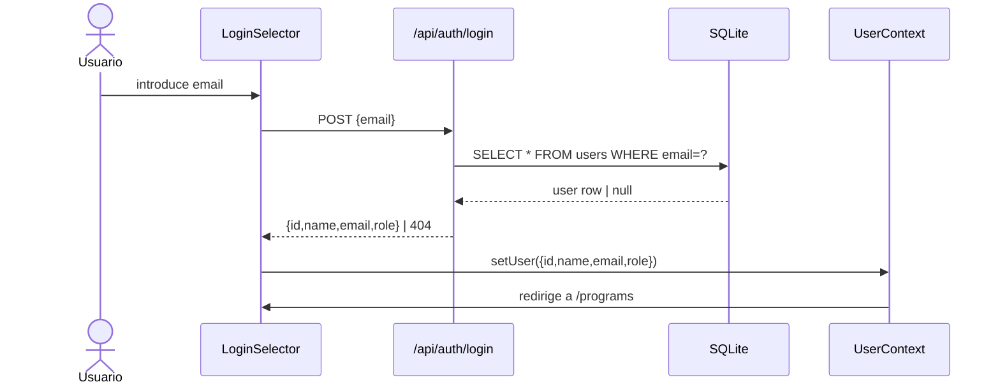

# Diseño Técnico: User Roles and Programs

## Overview

Esta feature extiende el sistema de usuarios de la aplicación Unbreakable para soportar:

- Autenticación por email (sin contraseña)
- Roles de usuario: `admin` y `user`
- Programas de entrenamiento con control de acceso por usuario
- Pantalla de selección de programa post-login
- Panel de administración para gestionar roles y accesos

El stack existente (Next.js + SQLite via wrapper propio `DB`) se mantiene sin cambios estructurales. No se introduce ningún sistema de sesiones de servidor; la identidad del usuario se sigue almacenando en `localStorage` a través del `UserContext`, pero ahora incluye `email` y `role`. La validación de permisos en endpoints de administración se realiza server-side consultando la BD con el `id` del usuario recibido en la petición.

---

## Architecture

```mermaid
flowchart TD
    A[LoginSelector] -->|email válido| B[UserContext\n{id,name,email,role}]
    B --> C[ProgramSelector]
    C -->|programa seleccionado| D[HomeClient\nprograma activo]
    C -->|rol admin| E[AdminPanel]

    E --> F[API /api/admin/users]
    E --> G[API /api/admin/programs]

    F --> H[(SQLite\nusers)]
    G --> I[(SQLite\nuser_programs)]
    G --> J[(SQLite\nprograms)]

    subgraph Server-side auth check
        F
        G
    end
```

### Flujo de autenticación



### Protección de rutas admin

La validación de permisos en endpoints `/api/admin/*` se hace server-side: el cliente envía el `userId` en la cabecera `x-user-id`, el servidor consulta la BD y verifica que `role = 'admin'`. No se confía en el rol almacenado en el cliente.

La ruta `/admin` (page.tsx) redirige al servidor si el usuario no es admin, usando un Server Component que lee la cookie de sesión o, en su defecto, delega la comprobación al cliente con redirect.

---

## Components and Interfaces

### Nuevos componentes

| Componente | Ruta | Descripción |
|---|---|---|
| `LoginSelector` | `src/components/LoginSelector.tsx` | Reemplaza `UserSelector`. Input de email + botón login. |
| `ProgramSelector` | `src/components/ProgramSelector.tsx` | Pantalla post-login. Lista programas del usuario. |
| `AdminPanel` | `src/app/admin/page.tsx` | Panel admin: gestión de roles y accesos. |
| `AdminClient` | `src/components/AdminClient.tsx` | Parte client del panel admin. |

### Componentes modificados

| Componente | Cambio |
|---|---|
| `UserContext` | Tipo `User` pasa a `{id, name, email, role}` |
| `HomeClient` | Recibe `programId` como prop para filtrar sesiones del programa activo |
| `page.tsx` (home) | Acepta `programId` en searchParams para cargar sesiones del programa correcto |

### API Endpoints

#### Existentes modificados

| Endpoint | Cambio |
|---|---|
| `GET /api/users` | Devuelve `id, name, email, role` |
| `POST /api/users` | Acepta `email`, asigna `role: 'user'` por defecto |

#### Nuevos endpoints

| Endpoint | Método | Descripción |
|---|---|---|
| `/api/auth/login` | POST | Busca usuario por email. Devuelve `{id,name,email,role}` o 404. |
| `/api/programs` | GET | Devuelve programas accesibles para el `userId` dado (header `x-user-id`). |
| `/api/admin/users` | GET | Lista todos los usuarios (requiere rol admin). |
| `/api/admin/users/[id]/role` | PATCH | Cambia el rol de un usuario (requiere rol admin). |
| `/api/admin/users/[id]/programs` | GET | Programas asignados a un usuario (requiere rol admin). |
| `/api/admin/users/[id]/programs` | PUT | Reemplaza los programas asignados a un usuario (requiere rol admin). |
| `/api/admin/programs` | GET | Lista todos los programas disponibles (requiere rol admin). |

### Helper de autorización server-side

```typescript
// src/lib/adminAuth.ts
export async function requireAdmin(req: NextRequest): Promise<{ id: number; role: string } | NextResponse> {
  const userId = req.headers.get('x-user-id');
  if (!userId) return NextResponse.json({ error: 'No autenticado' }, { status: 401 });
  const user = await DB.get('SELECT id, role FROM users WHERE id = ?', [userId]);
  if (!user) return NextResponse.json({ error: 'Usuario no encontrado' }, { status: 401 });
  if (user.role !== 'admin') return NextResponse.json({ error: 'Acceso denegado' }, { status: 403 });
  return user;
}
```

---

## Data Models

### Esquema de base de datos

#### Tabla `users` (modificada)

```sql
ALTER TABLE users ADD COLUMN email TEXT UNIQUE;
ALTER TABLE users ADD COLUMN role  TEXT NOT NULL DEFAULT 'user';
```

Schema final:

```sql
CREATE TABLE users (
  id    INTEGER PRIMARY KEY AUTOINCREMENT,
  name  TEXT    NOT NULL,
  email TEXT    UNIQUE,
  role  TEXT    NOT NULL DEFAULT 'user'
);
```

#### Tabla `programs` (nueva)

```sql
CREATE TABLE IF NOT EXISTS programs (
  id   INTEGER PRIMARY KEY AUTOINCREMENT,
  name TEXT    NOT NULL UNIQUE
);
```

#### Tabla `user_programs` (nueva)

```sql
CREATE TABLE IF NOT EXISTS user_programs (
  user_id    INTEGER NOT NULL REFERENCES users(id)    ON DELETE CASCADE,
  program_id INTEGER NOT NULL REFERENCES programs(id) ON DELETE CASCADE,
  PRIMARY KEY (user_id, program_id)
);
```

### Tipos TypeScript

```typescript
// src/lib/userContext.tsx
interface User {
  id:    number;
  name:  string;
  email: string;
  role:  'admin' | 'user';
}

// src/types/index.ts (nuevo)
interface Program {
  id:   number;
  name: string;
}

interface UserWithPrograms extends User {
  programs: Program[];
}
```

### Migración de datos existentes

El script de migración (`src/lib/migrate.ts`) se ejecuta al arrancar la app (en `DB.getInstance()` o en un endpoint dedicado). Es idempotente gracias al uso de `IF NOT EXISTS` y `ALTER TABLE ... IF NOT EXISTS` (SQLite ≥ 3.37) o comprobación previa de columnas.

```typescript
// Pseudocódigo de migración
await DB.run(`ALTER TABLE users ADD COLUMN email TEXT UNIQUE`);          // no-op si ya existe
await DB.run(`ALTER TABLE users ADD COLUMN role TEXT NOT NULL DEFAULT 'user'`);
await DB.run(`CREATE TABLE IF NOT EXISTS programs (...)`);
await DB.run(`CREATE TABLE IF NOT EXISTS user_programs (...)`);
await DB.run(`INSERT OR IGNORE INTO programs (name) VALUES ('Unbreakable')`);
// Asignar Unbreakable a todos los usuarios que no tengan ningún programa
await DB.run(`
  INSERT OR IGNORE INTO user_programs (user_id, program_id)
  SELECT u.id, p.id FROM users u, programs p WHERE p.name = 'Unbreakable'
`);
```

---

## Correctness Properties

*Una propiedad es una característica o comportamiento que debe cumplirse en todas las ejecuciones válidas del sistema — esencialmente, una afirmación formal sobre lo que el sistema debe hacer. Las propiedades sirven de puente entre las especificaciones legibles por humanos y las garantías de corrección verificables automáticamente.*

### Property 1: Login por email es una función total sobre usuarios registrados

*Para cualquier* email almacenado en la tabla `users`, el endpoint `POST /api/auth/login` debe devolver el objeto de usuario completo `{id, name, email, role}` con status 200.

**Validates: Requirements 1.3, 1.6**

---

### Property 2: Email vacío o no registrado es rechazado

*Para cualquier* string que sea vacío o que no corresponda a ningún email en la BD, el endpoint `POST /api/auth/login` debe devolver un error (400 o 404) y nunca un objeto de usuario.

**Validates: Requirements 1.4, 1.5**

---

### Property 3: Rol por defecto en creación de usuario

*Para cualquier* usuario creado sin especificar rol, el campo `role` almacenado en la BD debe ser `'user'`.

**Validates: Requirements 2.2, 2.3**

---

### Property 4: Consulta de programas devuelve solo los asignados

*Para cualquier* usuario y cualquier conjunto de programas asignados a ese usuario, la respuesta de `GET /api/programs` (con el `x-user-id` de ese usuario) debe contener exactamente los programas asignados y ninguno más.

**Validates: Requirements 3.3, 3.5**

---

### Property 5: Endpoint admin rechaza usuarios no autenticados

*Para cualquier* petición a un endpoint `/api/admin/*` que no incluya un `x-user-id` válido en la BD, el sistema debe responder con HTTP 401.

**Validates: Requirements 8.1, 8.3**

---

### Property 6: Endpoint admin rechaza usuarios con rol `user`

*Para cualquier* petición a un endpoint `/api/admin/*` realizada por un usuario con `role = 'user'`, el sistema debe responder con HTTP 403.

**Validates: Requirements 8.2, 8.3**

---

### Property 7: Cambio de rol es persistente y consistente

*Para cualquier* usuario y cualquier rol válido (`admin` o `user`), después de ejecutar `PATCH /api/admin/users/[id]/role`, una consulta posterior a la BD debe devolver el nuevo rol.

**Validates: Requirements 5.3, 5.5**

---

### Property 8: Migración es idempotente

*Para cualquier* estado inicial de la BD (con o sin las columnas/tablas nuevas), ejecutar la migración N veces debe producir el mismo estado final que ejecutarla una sola vez.

**Validates: Requirements 7.5**

---

### Property 9: Asignación de programas en migración

*Para cualquier* usuario existente antes de la migración, después de ejecutar la migración ese usuario debe tener acceso al programa "Unbreakable".

**Validates: Requirements 7.4**

---

## Error Handling

| Situación | Comportamiento |
|---|---|
| Email no encontrado en login | HTTP 404 + mensaje "Email no encontrado" |
| Email vacío en login | HTTP 400 + mensaje "Introduce tu email" |
| Petición admin sin `x-user-id` | HTTP 401 |
| Petición admin con rol `user` | HTTP 403 |
| `x-user-id` no existe en BD | HTTP 401 (sesión inválida) |
| Usuario sin programas asignados | `GET /api/programs` devuelve `[]`; el cliente muestra mensaje informativo |
| Revocar último programa | El cliente muestra confirmación antes de llamar a la API |
| Error de BD en migración | La migración lanza excepción; la app no arranca hasta resolverlo |

### Validación de sesión en cliente

Al cargar `UserContext` desde `localStorage`, si el `id` almacenado no existe en la BD (verificado con una llamada a `/api/auth/validate`), el contexto se limpia y se redirige al `LoginSelector`.

```typescript
// /api/auth/validate — GET con header x-user-id
// Devuelve 200 {valid: true} o 401 {valid: false}
```

---

## Testing Strategy

### Enfoque dual: unit tests + property-based tests

Ambos tipos son complementarios y necesarios para una cobertura completa.

**Unit tests** (Jest + React Testing Library):
- Ejemplos concretos de flujos de login (email válido, email vacío, email no encontrado)
- Renderizado de `ProgramSelector` con 0, 1 y N programas
- Renderizado de `AdminPanel` con lista de usuarios
- Integración entre `LoginSelector` → `UserContext` → `ProgramSelector`
- Casos de error en endpoints (respuestas 401, 403, 404)

**Property-based tests** (fast-check):
- Cada propiedad del apartado "Correctness Properties" se implementa como un test de propiedad
- Mínimo 100 iteraciones por propiedad
- Los generadores producen: emails aleatorios, usuarios aleatorios, conjuntos de programas, roles

### Configuración de property tests

```typescript
// Ejemplo de estructura de test
import fc from 'fast-check';

// Feature: user-roles-and-programs, Property 3: Rol por defecto en creación de usuario
test('nuevo usuario siempre tiene role=user por defecto', async () => {
  await fc.assert(
    fc.asyncProperty(
      fc.record({ name: fc.string({ minLength: 1 }), email: fc.emailAddress() }),
      async (userData) => {
        const user = await createUser(userData);
        expect(user.role).toBe('user');
      }
    ),
    { numRuns: 100 }
  );
});
```

Cada test de propiedad debe incluir el comentario:
`// Feature: user-roles-and-programs, Property N: <texto de la propiedad>`

### Cobertura esperada

| Área | Unit tests | Property tests |
|---|---|---|
| Login por email | ✓ | ✓ (Props 1, 2) |
| Roles por defecto | ✓ | ✓ (Prop 3) |
| Acceso a programas | ✓ | ✓ (Prop 4) |
| Auth admin endpoints | ✓ | ✓ (Props 5, 6) |
| Cambio de rol | ✓ | ✓ (Prop 7) |
| Migración idempotente | ✓ | ✓ (Props 8, 9) |
